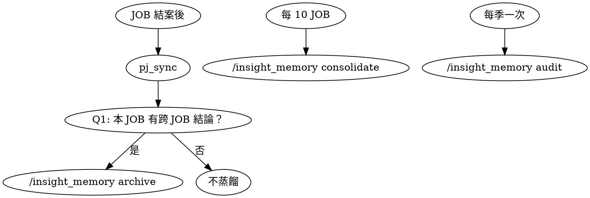

*Created by Claude Code (claude-opus-4-7) at 2026-05-18 19:50*

`last_updated`: 2026-05-18 19:50
`updated_by`: Claude Code (claude-opus-4-7)
`status`: 待裁定（design spec，尚未實作）

# 專案長期記憶 Skill 設計規格

> **本檔不是實作，是規劃**。經使用者裁定後才進入實作階段。

---

## 一、問題定義

### 1.1 既有系統覆蓋什麼

| 層級 | 機制 | 內容 |
|:--|:--|:--|
| 程式碼狀態 | git | 任何時點的 source of truth |
| 任務歷程 | `jobs/JOB-XXX*` + Report | 每個 JOB 的「做了什麼/結果」 |
| 規範原則 | `CLAUDE.md` + `README.md` + 各準則 | 「應該怎麼做」的最高指導 |
| 方法論細節 | `docs/`、`question/README_*.md` 等 | 「特定領域怎麼做」的 SOP |
| 跨專案記憶 | `~/.claude/projects/.../memory/` | user-level（不入 git、他人/他工具看不到）|

### 1.2 涵蓋不到的缺口

現有系統能回答「**做了什麼**」、「**該怎麼做**」，但**回答不了下列問題**：

1. **「為什麼專案長成現在這樣？」**（架構演化軌跡）
   - 例：「為什麼 KL/QL/CQI 體系是 v6 而不是 v2」— 答案分散在 JOB-100~150 多份 Report
2. **「我們試過什麼然後放棄？為什麼？」**（失敗-學習）
   - 例：「為什麼 OCR 走 ocrmac 而不是 codex Vision」— JOB-234 結論，但沒人會回去翻
3. **「跨 JOB 反覆出現的模式是什麼？」**（recurring patterns）
   - 例：「康軒 columns_reordered 在 JOB-236/239/240 三次 codex hung」— 各 JOB 各記，沒提煉
4. **「對工具/模型的特定理解」**（specific wisdom）
   - 例：「ChatGPT 訂閱不要硬指定 model」— user memory 有，但 project context 無
5. **「專案的隱性 DNA」**（implicit identity）
   - 例：「Eidos 之所以選 KL+QL 而非 Bloom，是因為...」— 沒人寫下來

### 1.3 為什麼這缺口重要

- **新 Claude session 啟動時**：讀 CLAUDE.md 知道規則，但**不知道「為什麼是這些規則」與「踩過哪些坑才有這些規則」**。
- **跨工具協作時**：Cursor / Antigravity / Codex 讀 CLAUDE.md 跟我一樣，缺同樣的脈絡。
- **多 session 後人類自己也會忘記**：當初為什麼決定 A 不決定 B。

> **核心斷言**：規範文件回答「How」，JOB Report 回答「What」，但「**Why**」與「**What we learned across JOBs**」目前沒有專門的家。

---

## 二、設計核心：知識蒸餾 vs. 摘要

### 2.1 兩者根本差異

| 摘要（Summary）| 蒸餾（Knowledge Distillation） |
|:--|:--|
| 壓縮：100 句 → 10 句 | 提煉：100 個事件 → 1 條原理 |
| 保留主幹 | 保留**「為什麼」** + 「考慮但放棄」 |
| 適合「快速回顧上次做了什麼」| 適合「回答未來新人/新 session 的 why」|
| Token 焦慮主導 | 智慧密度主導 |

### 2.2 蒸餾的「保留價值」標準

一條 candidate 是否值得進入長期記憶，**必須通過下列任一檢驗**：

1. **跨 JOB 重複性**：在 ≥2 個 JOB 中出現/解決，已成 pattern
2. **決策不可逆性**：選了 A 放棄 B，B 的理由失傳就無法回頭評估
3. **失敗成本記憶**：踩過坑後得到的規避策略，再踩就浪費時間
4. **隱性身分認同**：定義「我們是怎樣的專案」的核心信念
5. **跨工具/跨人共識**：Claude / Cursor / 使用者三方共同的理解錨點

**不通過上述任一檢驗 → 不蒸餾**。避免成為 noise dump。

### 2.3 不蒸餾清單（負面表列）

❌ 一次性任務細節（git log / Report 已有）
❌ 已在 CLAUDE.md / 準則文件 涵蓋的（避免重複，加 reference）
❌ 可從 git blame 重建的程式碼演化
❌ 個別 bug 的修法（除非該類 bug 反覆出現）
❌ Session 內溝通流水（如 user 提問→Claude 答覆）
❌ 推測性結論（必須是已驗證/已執行的）

### 2.4 三層深度的 Entry 結構（核心設計）

> **「淬煉」與「脈絡」不是對立，是同一條 entry 的不同層次。**

每個進 L3 的 entry **必須有三層**：

| 層 | 字數 | 回答 | 讀者目標 |
|:--|:--|:--|:--|
| **▸ 觀點層** | ≤80 字 | What（結論是什麼） | 30 秒看完抓重點 |
| **▸ 脈絡層** | 200-400 字 | Why & How we got here（為什麼變這樣） | 2 分鐘看完理解演化 |
| **▸ 證據層** | 連結列表 | Where to verify（細節在哪） | 需要深查時 drill-down |

#### Entry 範例

```markdown
### [PJ-001] 國語 L2 抽取的骨架可跨年級移植

▸ 觀點層（30 秒看完）
   chinese_codes_legal_II.json 一份 codes 可同時支撐 G3/G4 三下/四下 L2 抽取。
   骨架 (A1/A3/A4/A5/A6/A7/B/C/D) fork 即用，僅需 sed 替換路徑與 stage 標記。

▸ 脈絡層（2 分鐘看完）
   - 🎯 觸發：JOB-238 四下_國語 100% 成功後，假設可移植但未證
   - 🔄 嘗試與放棄：曾考慮為三下重做 codes（保守），證實沒必要
   - ⚡ 關鍵轉折：JOB-239 三下_國語 reuse JOB-238 codes，0 violations
   - 🛡️ 邊界條件：同階段（Ⅱ-II 或 Ⅲ-III）才可 reuse；跨階段不行

▸ 證據層（drill-down）
   - JOB-238 Report → 4888 題 / 100% legal
   - JOB-239 Report → 7562 題 / 100% legal
   - knowledge/3_考古題/3_L2_結構化抽取/_meta/chinese_codes_legal_II.json
```

#### 脈絡層的 4 個強制欄位

進入 L3 的 entry **必須填寫**下列 4 格，**填不出 → 不入 L3**：

| 欄位 | 寫什麼 | 檢驗句 |
|:--|:--|:--|
| 🎯 **觸發** | 什麼事件讓這條思路開始 | "本 entry 起點是 ___" |
| 🔄 **嘗試與放棄** | 考慮了什麼、為什麼放棄 | "考慮過 ___，但因 ___ 放棄" |
| ⚡ **關鍵轉折** | 哪個 JOB/commit/對話讓想法定型 | "在 ___ 之後想法變了" |
| 🛡️ **邊界條件** | 反例 / 什麼時候不適用 | "如果 ___ 就不能套用" |

**為什麼強制 4 格**：
- 填不出「嘗試與放棄」→ 多半是流水帳不是淬煉
- 填不出「邊界條件」→ 多半會變教條

### 2.5 作業類 vs 淬煉類 任務切割

| 任務類型 | 範例 | L3 處理 |
|:--|:--|:--|
| 純作業（視覺/字型/小修）| 改 H2 字級、改顏色 | **不入 L3**（git log 已是 SoT）|
| 任務變多輪後浮現新模式 | 連改 5 次字型發現需要 design tokens | **L3_emergent_learnings**（變「規律」就要記）|
| 新脈絡 / UX 思維變革 | 從「按鈕中心」改「對話中心」 | **L3_decision_trail**（含證據層連回 JOB）|
| 失敗-學習 | 試 Vite 改 Cloudflare 失敗 | **L3_failed_attempts**（避免未來重踩）|

**判定提問**：「6 個月後新人能從 git log + Report 自己看懂這件事的所有 why 嗎？」
- 是 → 不入 L3
- 否 → 入 L3，把 why 補在「脈絡層」

---

## 三、記憶層級架構（L3 補位）

### 3.1 既有三層

```
┌─────────────────────────────────────────────────────┐
│ L0 硬注入：CLAUDE.md / README.md / .cursorrules     │
│   工具保證 100% 載入。最高原則 + 索引。              │
└─────────────────────────────────────────────────────┘
┌─────────────────────────────────────────────────────┐
│ L1 軟注入：SessionStart Hook 注入準則精華摘要        │
│   100% 在 context。通用準則 + 派工準則 簡化版。     │
└─────────────────────────────────────────────────────┘
┌─────────────────────────────────────────────────────┐
│ L2 按需查閱：完整準則正文 / 派工 Report / 知識庫    │
│   Agent 依任務按需 Read。靠 L0/L1 索引引導。         │
└─────────────────────────────────────────────────────┘
```

### 3.2 新增 L3：跨 JOB 智慧蒸餾層

```
┌─────────────────────────────────────────────────────┐
│ L3 蒸餾記憶層（本 spec 提議新增）                    │
│   存在於 docs/project_memory/                       │
│   - INDEX.md 由 L1 Hook 注入（總是載入）            │
│   - L3_*.md 由 L2 按需查閱                          │
│   - _digest_log/ 歷史快照（追溯用）                  │
└─────────────────────────────────────────────────────┘
```

L3 與其他層的職責切割：

| 層 | 回答 | 例子 |
|:--|:--|:--|
| L0 | 「規則是什麼」 | 「禁止猜模型代碼」 |
| L1 | 「精華精華是什麼」 | 「派工三段式 Checklist」 |
| L2 | 「具體 SOP / 任務做了什麼」 | 「JOB-238 Phase 5 跑 ~10hr」|
| **L3** | **「為什麼這些規則演化成這樣 / 跨 JOB 學到什麼」** | **「columns_reordered 已知 codex hung 三次，stdin pipe 是穩定解」** |

---

## 四、檔案結構

```
docs/project_memory/
├── INDEX.md                       # 總索引（≤150 行；L1 Hook 注入）
├── L3_pj_dna.md                   # 專案 DNA：根本價值與身分認同
├── L3_decision_trail.md           # 重大決策軌跡（含「考慮但放棄」）
├── L3_recurring_patterns.md       # 反覆模式（成功+失敗）
├── L3_failed_attempts.md          # 嘗試後放棄的方法（避免重蹈覆轍）
├── L3_emergent_learnings.md       # 浮現的學習（meta-rules）
├── L3_tool_specific_wisdom.md     # 工具/模型在本專案的具體理解
└── _digest_log/                   # 「沒入 L3 的候選底稿」（不主動載入）
    ├── 2026-05-18_observations.md # 當天列了候選但使用者沒批准入 L3 的留底
    └── ...                        # archive 時 fallback 寫入；事後可回查再升 L3
```

### 4.1 各 L3 檔案規範（採用 §2.4 三層深度格式）

**所有 L3 檔案必須遵守的格式：**

```markdown
*Created by <Agent> (<model>) at <date>*

`last_updated`: <date>
`updated_by`: <Agent>

# L3_<topic>

> 本檔屬 **L3 蒸餾記憶層**。內容為跨 JOB 提煉的智慧結論。
> 每個 entry 採三層深度（觀點層 + 脈絡層 + 證據層），詳見 §2.4。
> 修改前請參考 §2.2 保留價值標準 + §2.4 4 個強制欄位。

## 條目

### [<entry_id>] <一句話標題>

▸ **觀點層**（≤80 字）
<結論是什麼>

▸ **脈絡層**（200-400 字，4 個強制欄位）
- 🎯 觸發：<什麼事件讓這條思路開始>
- 🔄 嘗試與放棄：<考慮了什麼、為什麼放棄>
- ⚡ 關鍵轉折：<哪個 JOB/commit/對話讓想法定型>
- 🛡️ 邊界條件：<什麼時候不適用>

▸ **證據層**（drill-down 連結）
- <JOB-XXX Report 路徑> → <一句話結論>
- <相關檔案路徑> → <一句話補充>

---
- **保留價值類型**: 跨JOB重複性 / 決策不可逆 / 失敗成本 / 身分認同 / 跨工具共識（擇 1+）
- **首次出現**: <JOB-XXX> 或 <date>
- **last_validated**: <date>（最後一次確認仍有效）
```

### 4.2 INDEX.md 格式

```markdown
# Project Memory Index

> L3 蒸餾記憶層總索引。本檔由 SessionStart Hook 自動載入。

## 快速地圖

| 想問什麼 | 看哪份 |
|:--|:--|
| 專案的根本價值是什麼 | L3_pj_dna.md |
| 為什麼選 A 不選 B（架構決策） | L3_decision_trail.md |
| 這個問題是不是反覆出現 | L3_recurring_patterns.md |
| 試過什麼後來放棄 | L3_failed_attempts.md |
| 跨多 JOB 浮現的新規則 | L3_emergent_learnings.md |
| 工具/模型的特定行為 | L3_tool_specific_wisdom.md |

## 最近三次蒸餾

- 2026-05-18 → [_digest_log/2026-05-18_digest.md] - 國語 L2 三連發後的蒸餾
- ...

## 已蒸餾條目總數

L3_pj_dna.md: <N> 條
L3_decision_trail.md: <N> 條
（依此類推）
```

---

## 五、Skill 行為設計

### 5.1 Skill 名稱與位置

- Skill 名：**`insight_memory`**
- 位置：`_agent/skills/insight_memory/SKILL.md`（沿 pj_sync 模式）
- 用戶觸發：`/insight_memory <mode>`

### 5.2 三種 Mode

#### Mode 1：`/insight_memory archive`（Session-end 手動）

**用途**：Session 結束前蒸餾本次對話 + 最近 N 個 JOB Report。

**輸入**：
- 本 session 對話歷史（自動取得）
- 最近 N=5 個 JOB Report（從 `jobs/` 抓 mtime 最新）
- 現有 L3 檔案（避免重複）

**流程（提案-批准雙層循環）**：
1. **Claude 萃取候選** — 對話 + 最近 N 個 Reports 中找出所有 candidate
2. **Claude 預分類 + 嘗試填三層** — 對每個 candidate 嘗試填脈絡層 4 必答欄位
   - 填得出 4 格 → 標 `[L3 候選]`
   - 填不出但有觀察價值 → 標 `[observation 候選]`
3. **列清單給使用者一次批准** — 表格形式呈現：
   ```
   #   類型              觀點層短句                    建議去向
   1   [L3 候選]         國語 L2 骨架跨年級可移植        L3_emergent_learnings
   2   [observation]     康軒第三條 codex 並行偏慢       _digest_log
   3   [L3 候選]         columns_reordered 必用 stdin    L3_recurring_patterns
   ```
4. **依使用者批准結果寫入**：
   - 批准入 L3 → 追加到對應 `L3_*.md`（含三層深度）
   - 沒批准 / 觀察類 → 寫入 `_digest_log/YYYY-MM-DD_observations.md`（簡短紀錄）
5. 更新 INDEX.md（條目數 + 升階指標）

**輸出**：
- 修改的 L3_*.md（追加，含三層深度）
- 新建/追加的 `_digest_log/YYYY-MM-DD_observations.md`（沒入 L3 的留底）
- 更新的 INDEX.md

**關鍵設計**：
- _digest_log/ **不主動載入到 context**（不占 token budget）
- 但留底可被 `/insight_memory consolidate` 回掃，**事後浮現價值的可升 L3**
- 純作業類任務（改畫面/字型）自然沉到 _digest_log 不入 L3

#### Mode 2：`/insight_memory consolidate`（週期性合併）

**用途**：每 N 個 JOB 後（或人工觸發），跨 JOB 大規模合併蒸餾。

**輸入**：
- 自上次 consolidate 後新增的 JOB Reports
- 所有 L3 檔案
- git log（補充演化脈絡）

**流程**：
1. 對所有新 Reports 萃取 candidate
2. 與既有 L3 條目比對 — 是否強化既有條目？是否與既有矛盾？
3. 重整 L3 檔案：合併、更新 `last_validated`、刪除被推翻的
4. 重寫 INDEX.md
5. 印出總結報告（新增 N 條、更新 M 條、淘汰 P 條）

**頻率建議**：每 ~10 個 JOB 結案後，或每月。

#### Mode 3：`/insight_memory audit`（過時檢查）

**用途**：定期檢查 L3 條目是否過時。

**流程**：
1. 對每個 L3 條目，檢查：
   - `last_validated` 是否超過 90 天
   - 引用的 JOB 是否仍存在
   - 引用的檔案路徑是否仍有效
   - 是否與最新 commit 的程式碼/規範矛盾
2. 列出可疑條目清單給使用者
3. 使用者裁定後標記/更新/刪除

**頻率建議**：每季一次。

### 5.3 三個 mode 的觸發時機



---

## 六、知識萃取方法論

### 6.1 蒸餾時的四個核心問題

每次 archive 時，對候選對話 + Reports 問：

1. **What's the why behind today's work?**（非 what）
2. **What did we try and abandon? Why?**
3. **What pattern emerged that wasn't obvious at start?**
4. **What rule of thumb crystallized?**

### 6.2 蒸餾品質 Checklist

每條寫入 L3 的 entry 必須通過：

- [ ] 條目標題能在 10 秒內被新 session 理解
- [ ] 「為什麼」段落有具體因果鏈，不只是「因為這樣比較好」
- [ ] 「考慮但放棄」段落（若適用）有具體拒絕理由
- [ ] 附 ≥1 個 JOB-XXX reference 可追溯
- [ ] 反例段落避免條目被教條化
- [ ] 內容 100-500 字（太短沒蒸到，太長沒蒸夠）

### 6.3 token-cost-aware 萃取規則

依使用者預算（0.05M~0.15M）反推：

| 檔案 | 目標 size | 上限 |
|:--|:--|:--|
| INDEX.md | ~1K tokens（一頁索引）| 5K |
| 各 L3_*.md | ~10K tokens / 檔 | 30K |
| 最近 _digest_log | ~3-5K tokens | 10K |
| **合計（auto-load）** | **~50-70K tokens** | **150K** |

超過上限 → 觸發 consolidate 模式進行二次蒸餾。

---

## 七、與既有系統整合

### 7.1 與 CLAUDE.md / 準則文件

- L3 **不取代** CLAUDE.md 與準則；CLAUDE.md = Why-Rules，L3 = Why-Behind-Rules
- 若 L3 浮現的學習穩定到「該變成規則」，**升階流程**：
  - L3 條目 → 標記 promote_candidate → 使用者裁定 → 寫入準則文件 / CLAUDE.md → L3 條目改為 reference

### 7.2 與派工系統

- 派工 Report 仍是 single source of truth for「**做了什麼**」
- L3 條目 **必須附 ≥1 個 Report reference**（追溯性）
- pj_sync 觸發後可選擇性執行 `/insight_memory archive`

### 7.3 與 SessionStart Hook

修改 `.claude/settings.json` 的 SessionStart：

```yaml
# 既有：
- 注入通用準則精華
- 注入派工準則精華

# 新增：
- 注入 docs/project_memory/INDEX.md（一頁索引，~1K tokens）
- 注入最近 1 份 _digest_log（最新蒸餾，~5K tokens）
```

### 7.4 與 user-scoped memory

| 範疇 | 機制 | 例子 |
|:--|:--|:--|
| 使用者個人 cross-project 偏好 | `~/.claude/projects/.../memory/` | 「我是這個專案的 PM，喜歡簡短回覆」|
| 本專案 cross-session 智慧 | `docs/project_memory/` L3（本 spec） | 「Eidos KL/QL 體系演化軌跡」|

兩者**不重疊**：user memory 跨專案、L3 跨 session 但綁專案。

### 7.5 與 Cursor / Antigravity

- L3 在 `docs/` 內，所有工具均可讀
- `.cursorrules` 可 reference INDEX.md
- Antigravity 的 `GEMINI.md`（未來）同樣可 reference

---

## 八、執行規劃

### Phase 1：Spec 裁定（本檔）
- 使用者審閱、提修改、確認
- **DoD**：本檔 status 從「待裁定」→「已採納」

### Phase 2：手動建立首批 L3 內容（pilot）
- Claude 親做：讀最近 10 個 JOB Report + 本專案 CLAUDE.md
- 產出 INDEX.md + 至少 3 個 L3_*.md（不必齊全 6 份）
- 寫第一份 `_digest_log/<date>_digest.md`
- **DoD**：使用者可從 INDEX.md 快速了解專案近期智慧 + 至少回答 §1.2 的 5 個問題其中 3 個
- **預估時間**：~2-3 hr

### Phase 3：Skill 自動化
- 建立 `_agent/skills/insight_memory/SKILL.md`
- 實作三個 mode（archive / consolidate / audit）
- 更新 SessionStart Hook 自動載入 INDEX.md + 最新 digest
- **DoD**：`/insight_memory archive` 可一鍵跑通
- **預估時間**：~3-4 hr

### Phase 4：規範整合 + 升階流程
- 更新 CLAUDE.md：新增 §5「資訊分層取用架構」加 L3 列
- 定義「L3 條目升階為規則」的流程
- 文件交給 Antigravity / Cursor 設定檔 reference
- **DoD**：使用者 + 3 個 AI 工具均可正確使用 L3
- **預估時間**：~1-2 hr

### Phase 5：第一次 consolidate（壓力測試）
- 跑 `/insight_memory consolidate` 對全部 240 個既有 JOB
- 看會浮現出什麼跨 JOB 模式
- 校正方法論（質量 Checklist）
- **DoD**：產出可被使用者認可的 cross-JOB insights
- **預估時間**：~4-5 hr

---

## 九、開放問題（待使用者裁定）

### Q1：蒸餾觸發時機與機制 ✅（已裁定 2026-05-19）

**已選定機制**（§5.2 Mode 1 詳述）：
- Claude 提案 candidates + 預填三層深度
- 使用者一次批准 → 批准入 L3、沒批准入 _digest_log
- _digest_log 不主動載入，但可被 consolidate 事後升 L3

### Q2：L3 檔案的 6 份分類是否合理？

是否應該合併成 ≤3 份？或拆得更細？

**Claude 建議**：先用 6 份起跑，Phase 5 consolidate 時根據實測結果調整。

### Q3：與 docs/superpowers/specs/ 的關係？

既有的 superpowers 體系也有 `docs/superpowers/specs/` 規劃。L3 是否該放那邊？

**Claude 建議**：分開。superpowers/specs 是「工程規格」(feature design)，L3 是「歷史智慧」(distilled wisdom)。兩者並列。

### Q4：是否要追加 Skill 的「query」mode？

例：`/insight_memory query "為什麼用 codex 不用 cursor"` — 從 L3 找答案。

**Claude 建議**：v1 不做，先讓 INDEX.md + Read tool 解決。若需求成熟再加。

### Q5：Cursor / Antigravity 是否需要對應觸發機制？

`/insight_memory archive` 是 Claude Code skill，其他工具看不到。

**Claude 建議**：v1 由 Claude 為「總管」執行蒸餾，其他工具消費 L3 即可。日後可考慮 .cursorrules 加 hook。

---

## 十、設計核心信念（不可妥協）

1. **In-Repo**：所有 L3 內容必須在 git 內，他人/他工具可讀。
2. **Markdown-only**：不依賴外部 DB / MCP server / 雲服務。
3. **Distillation > Compression**：保留「為什麼」與「考慮但放棄」。
4. **Cross-JOB or Drop**：不能跨 JOB 連結的條目不蒸餾。
5. **追溯可達**：每條都附 ≥1 個 JOB-XXX reference。
6. **避免教條**：每條附「反例 / 不適用情境」。
7. **升階通道**：穩定的 L3 條目可升為 L0 規則（不困死在 L3）。
8. **不重複**：與 CLAUDE.md / 準則 / Report 任何重疊 → 改為 reference。

---

## 十一、Spec 結論與下一步

**本檔（spec_insight_memory.md）是規劃。**

請使用者裁定：

1. ✅ **接受設計** → 進 Phase 2（手動建立 pilot L3 內容）
2. 🔧 **要修改**：請指出哪些段落 / 哪些開放問題的選擇要改
3. ❌ **不採納** → 廢棄本 spec

---

## 附錄 A：與 Gemini 對話建議的差異

| Gemini 建議 | 本 spec 差異 | 理由 |
|:--|:--|:--|
| 依賴 sequential-thinking MCP | 內建到 skill 方法論 | MCP 工具不在 repo，跨工具不通 |
| Composio / Mem0 等外部服務 | 不用 | 違反「In-Repo」核心信念 |
| Claude Dreaming（自動化背景） | 手動觸發為主 | 自動化會稀釋密度，Q1 已分析 |
| `~/.claude/skills/archive.md` (user-scoped) | `_agent/skills/` (project-scoped) | L3 是 project memory，不該綁 user |
| 「結構化輸出 Markdown」一般指南 | 詳細到 6 份 L3 + 條目格式 + 質量 Checklist | Gemini 建議偏概念，本 spec 偏可執行 |

## 附錄 B：相關既有檔案

- `CLAUDE.md` 五、Agent 資訊分層取用架構（L0/L1/L2 表）
- `docs/README_通用作業準則.md`
- `docs/README_任務派工準則.md`
- `_agent/skills/pj_sync/SKILL.md`
- `~/.claude/projects/-Users-s389080-Documents-doc-work-0-AI-Project-eidosProject/memory/MEMORY.md`（user-scoped 記憶範例）
