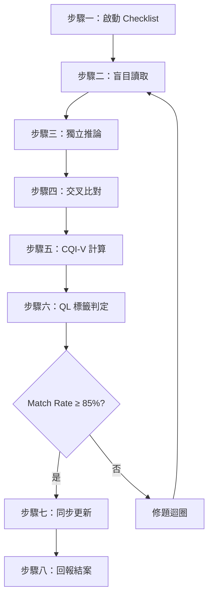

*Created by AG at 2026-03-24 09:30*

`last_updated`: 2026-03-28 20:18
`updated_by`: Antigravity (Claude Opus 4.6)
`version`: 2.0（重構版）
`status`: plan_only

# JOB-103-PLAN-S2-國語盲測驗證-全年級品質精修

**`job_type`**：`question_verify`
定義與邊界見 **`docs/README_任務派工準則.md`** 第二章。

> [!IMPORTANT]
> 本派工單為 v2.0 重構版。v1.0 的虛假彙報問題（Match Rate 100% 實測僅 61%）已在歷史缺陷章節記錄。
> v2.0 強制套用 VAT 驗證稽核軌跡 + MTP Mismatch 分流 + SAB 批次機制。

---

## 📌 任務背景

JOB-102（v2.0）產出的國語題庫需要全量盲測驗證。本 JOB 為 JOB-102 的下游任務，必須在 JOB-102 各 Batch 完成後依序啟動。

**驗證範圍**：JOB-102 四個 Batch 產出的全部題目 + G3 已 QL4 部分的抽檢確認

## 🎯 任務目標（DoD）

> [!IMPORTANT]
> 所有驗收項目皆須 100% 通過，方可結案。

1. 全線 Match Rate ≥ 85%
2. 全線 CQI 平均 ≥ 6.5（QL4 門檻）
3. 零 QL1（BIAS）題目殘留
4. 所有題目 JSON 包含 `verifying_model` 與 `verification` 欄位
5. 100% 全測覆蓋（禁止抽樣）
6. 進度總表即時同步

---

## 📖 執行步驟（基於 `/ei_verify` 八步驟）

---

### Phase 1：G4 S2 全線盲測（JOB-102 Batch 1 產出）

> 預估：~36 單元 × 30 題 = ~1080 題。**重點**：南一舊 BIAS 題已替換確認。

#### G4 翰林版
- [ ] L1 盲測 → Match Rate ___% → CQI-V ___ → QL___
- [ ] L2 盲測 → Match Rate ___% → CQI-V ___ → QL___
- [ ] L3 盲測 → Match Rate ___% → CQI-V ___ → QL___
- [ ] L4 盲測 → Match Rate ___% → CQI-V ___ → QL___
- [ ] L5 盲測 → Match Rate ___% → CQI-V ___ → QL___
- [ ] L6 盲測 → Match Rate ___% → CQI-V ___ → QL___
- [ ] L7 盲測 → Match Rate ___% → CQI-V ___ → QL___
- [ ] L8 盲測 → Match Rate ___% → CQI-V ___ → QL___
- [ ] L9 盲測 → Match Rate ___% → CQI-V ___ → QL___
- [ ] L10 盲測 → Match Rate ___% → CQI-V ___ → QL___
- [ ] L11~L12（依實際課數調整）

#### G4 康軒版
- [ ] L1~L12 逐課盲測（同上格式）

#### G4 南一版
- [ ] L1~L12 逐課盲測（同上格式）
- [ ] **特別確認**：舊 QL1 BIAS 檔案已替換、新題目無繼承舊污染

#### Phase 1 驗收
- [ ] G4 整體 Match Rate ≥ 85%
- [ ] G4 整體 CQI 平均 ≥ 6.5
- [ ] 修題迴圈完成（同一題修正不超過 3 次）
- [ ] JSON 回寫 `verifying_model`、`verification`、`cqi_score` 欄位
- [ ] VAT 日誌已產出：`logs/blind_eval_G4_*.json`
- [ ] 同步進度總表

---

### Phase 2：G3 S2 南一精修驗證（JOB-102 Batch 2 產出）

> 預估：~395 題。**重點**：JOB-116 揭露的內容污染 + 題幹截斷已修復確認。

- [ ] G3 南一 L1~L14 逐課盲測
- [ ] **特別確認**：L4（楊修猜字）已無內容污染
- [ ] **特別確認**：L4/L8 題幹皆 > 15 字（無截斷）

#### G3 康軒/翰林（已 QL4 抽檢）
- [ ] 執行 CQI 基線跑分
- [ ] 若已有 `verification` 欄位且 CQI ≥ 6.5 → **跳過**
- [ ] 若有缺驗證欄位的題目 → 補驗

---

### Phase 3：G5 S2 全線盲測

#### G5 康軒
- [ ] L1~L12 逐課盲測

#### G5 翰林
- [ ] L1~L12 逐課盲測

#### G5 南一（JOB-102 Batch 3 精修後）
- [ ] L1~L12 逐課盲測
- [ ] 確認 CQI 從 4.30 已拉升

---

### Phase 4：G6 S2 全線盲測

- [ ] G6 翰林 L1~L6 逐課盲測
- [ ] G6 康軒 L1~L6 逐課盲測
- [ ] G6 南一 L1~L6 逐課盲測

---

### Phase 5：結案

- [ ] 全線 CQI 平均 ≥ 6.5 確認
- [ ] 零 QL1 (BIAS) 殘留確認
- [ ] 所有 JSON 已回寫 `verifying_model` 與 `verification` 欄位
- [ ] 所有 VAT 日誌路徑已記錄
- [ ] `docs/進度彙整_題庫研發與產出.md` 最終同步
- [ ] 撰寫 JOB-103-Report.md
- [ ] 花費匯總

---

## 📜 關鍵參考檔案

| 檔案路徑 | 用途 |
|:--|:--|
| `question/README_驗證與盲測準則.md` | CQI-V 計分、盲審三步驟、SAB/VAT/MTP |
| `question/README_出題與品管準則.md` | CQI-P 計分 |
| `_agent/skills/ei_verify/SKILL.md` | 驗證觸發器 |

## ✅ 啟動 Checklist (Pre-Flight)

- [ ] 已讀取：`question/README_驗證與盲測準則.md`
- [ ] 已讀取：`question/README_出題與品管準則.md`
- [ ] 確認驗證模型與出題模型不同（雙盲原則）
  - 出題模型：gemini-3-flash
  - 驗證模型：________（需與出題模型不同，待確認）
- [ ] **已確認使用金鑰**：[金鑰：Yotta eidosFree（免費 Key）]
- [ ] 執行 CQI-P 基線跑分，確認全線 ≥ 5.5
- [ ] 驗證範圍確認：G3~G6 / 全版本 / ____ 題（100% 全測）

> [!WARNING]
> **雙盲問題**：出題與驗證均使用 gemini-3-flash 時，不符合雙盲原則。
> 可接受方案：(1) 使用不同溫度參數 (2) 報告中標註「單盲提示」(3) 改用其他免費模型驗證。

## ✅ 驗收 Checklist (Acceptance)

- [ ] 全線 Match Rate ≥ 85%
- [ ] 全線 CQI 平均 ≥ 6.5
- [ ] 零 QL1 (BIAS)
- [ ] 所有 JSON 含 `verifying_model` + `verification`

## ✅ 成果 Checklist (Deliverables)

- [ ] 成果表格已填寫
- [ ] 進度總表已同步
- [ ] 已執行 `/pj_sync`
- [ ] 產出 JOB-103-Report.md
- [ ] 所有 VAT 日誌路徑已記錄

---

## 📋 成果紀錄表

| 年級 | 版本 | 單元數 | 題數 | Match Rate | CQI 平均 | QL | 驗證模型 | VAT 日誌 | 執行日期 |
|:---:|:---:|:---:|:---:|:---:|:---:|:---:|:---|:---|:---|
| G4 | 翰林 | — | — | —% | — | — | — | — | — |
| *(執行時逐行填入)* | | | | | | | | | |

---

## 🛡️ 驗證防線機制

### SAB 科目自適應批次
- **Chinese = 10 題/批**

### VAT 驗證稽核軌跡
- 每批次產出 `logs/blind_eval_{filename}_{timestamp}.json`
- JOB Report 中必須附上日誌路徑

### MTP Mismatch 分流協議
| 分類 | 條件 | 處理 |
|:---:|:---|:---|
| TYPE-A | AI 幻覺（選項存在但 AI 未找到） | 自動標記 `resolved`，不扣分 |
| TYPE-B | 原題錯誤（AI 推論正確，原答案不合理） | 標記 `original_flaw`，修題 |
| TYPE-C | 待人工裁定 | 標記 `manual_review` |

---

## 🔴 歷史缺陷追溯（保留自 v1.0）

### 缺陷 1：虛假彙報
- v1.0 宣稱 Match Rate 100%，2026-03-27 實測南一 G3 L4 僅 61%
- **v2.0 修復**：強制 VAT 日誌

### 缺陷 2：Batch Size 失當
- 使用 BATCH_SIZE=30 導致驗證幻覺
- **v2.0 修復**：SAB 機制（Chinese=10）

### 缺陷 3：無 Mismatch 分流
- **v2.0 修復**：MTP 分類（TYPE-A/B/C）

---

## 真實回報本次對話的模型與花費
＄作業匯總 ：Token數:- | 花費: $- | 使用模型: - | 執行者: AG
