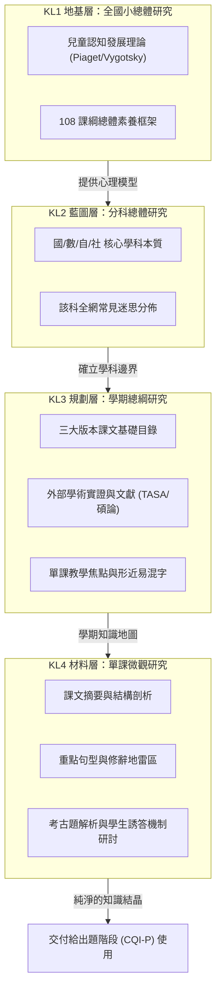

# 研究架構總綱 (Knowledge Layer & Research Maturity)

`last_updated`: 2026-04-29
`updated_by`: Claude Code (claude-sonnet-4-6)
`version`: 4.5

**文件定位**：本文件為 Eidos 專案的研究工作指導手冊（KL1-KL4 & RM0-RM3）。
專注於「知識探勘、文本深掘、迷思追蹤」，不涵蓋出題、AI Prompt 撰寫或品質控管邏輯。

> **索引約定**：`knowledge/` 下不另建 `README.md` 或 `AGENT_知識層必讀索引.md`；以本檔為知識層總入口，各科細部導覽（如 `課綱研究/國語/README.md`）由該科目維護。

> [!IMPORTANT]
> - 出題與 AI Prompt 指南：`question/README_出題與品管準則.md`
> - 盲測與品質標籤指南：`question/README_驗證與盲測準則.md`
> - **原則**：研究階段只負責「找出真相（文本內容／學生迷思）」，將「如何把真相變成題目」留給下一個出題階段。

---

## 知識大廈架構 (KL1 → KL4)



---

## 第一層：KL1 地基層 (全國小總體研究)

核心問題：**孩子的大腦準備好了嗎？不同年齡的大腦如何運作？**

| 心理學理論 | 研究關注重點 (在研究階段尋找什麼) |
|:--|:--|
| **皮亞傑 (Piaget) 階段論** | 尋找各年級課綱中「具體操作」轉向「抽象思考」的臨界點。 |
| **維高斯基 (Vygotsky) ZPD** | 標註出孩童在無鷹架輔助下「無法獨立理解」的概念。 |
| **認知負荷理論** | 記錄各單元資訊量，標示「文本過載」的危險單元。 |

---

## 第二層：KL2 藍圖層 (分科總體研究)

核心問題：**這個科目在 G1~G6 知識脈絡的演進為何？**

- **產出檔案**：`knowledge/1_課綱研究/[科目]/KL2_[科目]科共同發展總綱.md`（**每科僅此一檔**承載 KL2；**勿**另立同名異檔。英語科並以 `英語科_題庫數量規劃.md` 承載全科題量矩陣，與 KL2 分工。）
- **內容要求**：
  1. 該學科的本質（國語重文本結構、數學重邏輯遞進）。
  2. 該學科最常見的歷史迷思概念地圖（如數學的「平分迷思」、國語的「因果錯置」）。

---

## 第三層：KL3 規劃層 (學期總綱研究)

核心問題：**這一科這學期教什麼？有什麼客觀數據能佐證學習痛點？**

- **產出檔案**：`knowledge/1_課綱研究/[科目]/[學期]/KL3_[學期]_[科目]_研究總綱.md`
- **命名規範（強制）**：舊式尾碼 `_發展綱要` 為技術債，JOB-212 起全面收斂為 `_研究總綱`；不得新建含 `_發展綱要` 的 KL3 檔案
- **課名清單（必要產出）**：KL3 的第一必要產出為「三出版社課名清單」（各版本各冊所有課文標題）；課名清單是唯一真相來源，出題/研究人員查找課名必須查閱對應 KL3 檔案，不得另建課名清單
- **內容要求**：
  1. **跨版本矩陣（含課名清單）**：康軒、翰林、南一每課的課名與文本類型對照；本矩陣即為課名清單的標準格式。
  2. **學術實證**：蒐集 TASA 等報告，必須引用 ≥ 3 種實質外部來源並進行交叉比對。
  3. **微觀地雷矩陣**：彙整該學期所有單元的「核心語法地雷」與「認知地雷」。

---

## 第四層：KL4 材料層 (單課微觀研究)

核心問題：**這一課的骨肉是什麼？學生做這課的考古題時都在哪裡跌倒？**

- **產出架構**：採「一課雙檔」制作制
  - `KL4_[學期]_[版本]_L[課號]_[課名]_單課研究紀錄.md`
  - `KL4_[學期]_[版本]_L[課號]_[課名]_考古題與討論.md`
  - **層次**：**KL4 複製準則與範本（國語）**統一置於 **`課綱研究/國語/`**：`README_KL4單課建置與複製準則.md`、**`_範本_KL4_國語_單課研究紀錄.md`**、**`_範本_KL4_國語_考古題與討論.md`**（**每層次各一檔**，無「待填／完整」雙軌）。**學期／版本**子目錄（如 `四下/翰林/`）僅放單課實檔，**不在**深層累積 README 或準則檔。派工清單以 **`jobs/JOB-XXX`** 為準。
  - **已填示範（連結即可，非範本檔）**：金標實檔例見 `課綱研究/國語/四下/翰林/KL4_四下_翰林_L1_稻間鴨_單課研究紀錄.md` 與同課考古副檔；G3 對照例見 `課綱研究/國語/三下/康軒/KL4_三下_康軒_L5_學田鼠開路_單課研究紀錄.md` 與同課考古副檔。
- **素材庫大檔禁止規則（JOB-212 起）**：禁止建立「多課合一」的 KL4 大檔（如 `KL4_三下_國語_原始研究素材庫.md` 這類跨課合併格式）。此格式為歷史技術債，由 JOB-212 Phase D2 逐步拆解；新建 KL4 研究必須嚴格遵循「一課雙檔」制。
- **內容要求**：
  1. **單課研究紀錄**：課文實體摘要、起承轉合結構、生字/易混字地圖、語法守衛點。
  2. **考古題與討論**：**真實考古題**建檔（≥ 8 道/課），並深刻討論「學生為何會選錯（誘答機制解析）」，以及研究人員針對該迷思的探討紀錄。

> **考古題真實性規範（全科目適用）**
> - 考古題必須來自**真實考卷**（學校段考、月考、出版社評量卷），禁止自行編造假裝為考古題。
> - 每道考古題須標註來源（學校名稱＋學年度＋考試類型，或可驗證之 URL）。
> - **出題卡點（Production Gate）**：每課必須同時滿足以下兩條件，才允許進入出題階段：
>   1. 至少 **10 道**可明確歸屬該課的真實考古題
>   2. 來自 **≥2 個不同的外部來源**（不同學校、不同網站均可）
> - **課次歸屬分類原則（Classification Rule）**：
>   - 只計算題目內容**明確包含該課專屬詞彙或概念**的題目為該課題目。
>   - 無法明確判斷屬於哪一課的題目（如跨課複合題、通用常識題），標記為 `lesson: "ambiguous"` 或 `lesson: "L2_or_L3"` 等，**不計入**任何單課的達標計數。
>   - Ambiguous 題目可用於通用迷思研究，但不作為課次專屬考古題引用。
> - **考古題是參考座標，不是抄寫範本**：考古題用於確認出題範疇與課文是否相符、誘答設計是否具參考價值、學生迷思的實證基礎。**嚴禁原封不動照抄為自有題庫**。正確做法是基於對課文的深度理解與原創思考重新設計，在文筆、情境、知識深度上超越原始考卷。
> - 若窮盡搜尋仍不足門檻，須在 KL4 檔案中**明確標註**不足事實與已嘗試之搜尋來源，不得以自編題充數，且**該課禁止出題**直到補齊。
> - **考古題來源與智財規範**：見 `knowledge/3_考古題/README.md`，包含來源 SOP、課次分類準則、智財使用邊界。

---

## 研究成熟度 (RM0-RM3)

每一課或每一單元的研究進度，以 RM 代碼標示其「知識探勘」的深度：

| 階段 | 名稱 | 達成條件（研究視角） | 該課題目最高可達 QL |
|:--|:--|:--|:--:|
| RM0 | 骨架期 | 僅有課名與大單元分類，無實質文本。 | QL1（禁止出題） |
| RM1 | 素材期 | 取得課文全文或精確摘要（KL4 單課研究紀錄建立）。 | QL2 |
| RM2 | 考古期 | 收集到考古題，並完成學生錯誤機制的追溯（KL4 考古題與討論建立）。 | QL3 |
| RM3 | 透析期 | 完成文本結構分析、語法地雷解析與迷思研討（KL4 雙檔建置完成）。 | QL4（需盲測通過） |

> **RM → QL 是天花板關係**：RM 決定該課題目的 QL 上限。完整 QL 定義請見 `question/README_驗證與盲測準則.md` 第四章。
>
> **RM 是「素材潛力」，不等於最終品質**：素材備得越齊（高 RM）只是**有機會**做出高 QL 題；若出題或盲測沒做好，最終 QL 仍可能偏低。RM 看投入（素材）、QL 看產出（成品），是兩條獨立的軸。

---

## 研究路徑：α 標準路徑 vs. β+ 補償路徑（2026-04-21）

實務上**課文原文並非百分百能取得**（出版社授權、實體課本翻拍限制、電子書版權等因素）。為區分兩種情境且不讓「無課文」拉低實質題目品質，本專案採**雙軌路徑**設計：

### α 標準路徑（有課文）

- 研究流程：RM0 → RM1（取得課文）→ RM2（收集考古題）→ RM3（透析）
- 題庫天花板：**QL4**（盲測通過後）
- KL4 單課研究紀錄含「課文全文錄製」或精確摘要章節
- 考古題蒐集門檻：**≥10 題 + ≥2 外部來源**（既有鐵律）

### β+ 補償路徑（無課文）

- 研究流程：RM0 → **跳過 RM1** → RM2+（考古題加量收集）→ RM3(β+)
- 題庫天花板：**QL3**（盲測通過後；以「β+」尾碼標註與 α 路徑區分）
- KL4 單課研究紀錄改寫「課文主要概念（β+ 推測版）」章節，明確標註「非出版社原文，基於發展綱要 + 考古題反推」
- **考古題補償**：以「努力上限」取代「數量下限」——**每課 15 分鐘用盡資源蒐集**（不設題目數量底線，警戒值 ≥ 10）
- **反推深度強化**：每題標註「知識點對應／出現頻率／學生常錯點」
- **雙重盲測**：原 1 模型改為 2 不同模型（例 Gemini Flash + Claude Haiku），兩者都 Match 才通過
- **回測驗證**：出題完成後每題對照 ≥ 3 道類似主題考古題，確認難度風格一致

### 兩路徑對照

| 項目 | α 標準 | β+ 補償 |
|:--|:--:|:--:|
| 需要課文 | ✅ | ❌（明確註明無課文） |
| 考古題策略 | ≥10 題 + ≥2 來源 | **15 分鐘努力上限，多多益善** |
| 盲測模型數 | 1 | **2** |
| 回測驗證 | 選配 | **強制** |
| QL 天花板 | QL4 | QL3 |
| 標籤尾碼 | — | **β+** |

**核心精神**：標籤不虛報（QL 分級誠實反映研究深度），但**實質品質不打折**（透過 BCDE 補償方法讓 β+ 題目接近 QL4 的實用水準）。

> **完整方法論**：見 `knowledge/5_學習議題研究/無課文情境的考古題補償研究法.md`（含 G3 S2 社會 南一 L5「打造幸福的家園」完整案例）

---

## 研究流程程序與原則

> **本章定位**：說明研究工作的執行順序、每步的目的與責任人。不涉及工具操作與指令細節（CLI 用法見 `_agent/skills/` 技能檔）。

### 一、研究流程四階段

```
[KL2 確認] → [KL3 建立/補強] → [KL4 建立] → [RM 升級]
```

| 階段 | 任務 | 目的 | 責任人 |
|:--|:--|:--|:--|
| **KL2 確認** | 讀取同科 KL2；如不足 DoD，先補強 | 確保下游 KL3/KL4 有學科定錨，防止知識點偏移 | PM 裁定；若 KL2 已足，跳過 |
| **KL3 建立** | 三版本課名清單 + 學術文獻 + 跨版本矩陣 + 迷思地雷矩陣 | 建立學期知識地圖；確立課名（所有下游 KL4 的名稱唯一來源） | 執行者依 KL3 模板建檔 |
| **KL4 雙檔建立** | 確認 α/β+ 路徑 → 建立單課研究紀錄 → 蒐集考古題 → 建立考古題與討論 | 逐課建立可出題的知識基礎 | 執行者依 KL4 模板建檔 |
| **RM 升級與自稽** | 每課達 RM2（考古題 ≥10 + ≥2 來源）後才可進入出題階段 | 防止未熟成的素材流入出題端 | 執行者自稽；PM 抽查 |

### 二、研究原則（Why）

1. **自下而上填實，自上而下定錨**：KL2/KL3 提供學科邊界與課名，KL4 不得另自定義；KL4 發現新迷思時，可向上回饋更新 KL3/KL2。
2. **真實性不妥協**：考古題必須來自真實考卷（不可自編），課文摘要必須基於實際文本（不可推測替代）。
3. **先試行一課，再批量複製**：每個學期/版本首次執行，先完成一課到 RM3，PM 確認品質後再批量其餘課次。
4. **縱向一致，橫向比對**：同一學期三版本的考古題蒐集必須對齊（相同的來源優先級），跨版本知識點差異需在 KL4 記錄。

---

## 歷史卡點與防範

> 本章整理歷史 JOB 中實際發生的研究卡點，每條附「觸發情境」與「防範措施」。執行新研究 JOB 前必讀本章。

### KP-01：自編考古題冒充真實（JOB-170）

**觸發情境**：執行者以自行編造的題目填充 KL4 考古題與討論檔，初版通過格式檢查但被 PM 發現，整批 18 個考古題與討論檔必須重做。

**防範措施**：
- 每題必須標明「來源：XX 學校 + 學年度 + 考試類型」，無來源標記的題目不計入達標題數。
- 建立第一題前，必須先確認已取得真實考卷 MD（位於 `knowledge/3_考古題/2_MD淬鍊文字/`）。
- 若無真實考卷可用，在 KL4 考古題與討論檔標注「RM2 未達標：考古題不足，已嘗試來源：[列出]」，禁止出題。

### KP-02：KL3 命名混亂導致 Agent 找不到資料（JOB-212）

**觸發情境**：KL3 檔案有三種不同命名格式（缺 `KL3_` 前綴、用「發展綱要」非「研究總綱」、缺學期縮寫），後續 Agent 搜尋 `KL3_[學期]_[科目]_研究總綱.md` 時找不到，導致從頭重建或跳過。

**防範措施**：
- 所有 KL3 檔案強制遵守命名規範：`KL3_[學期]_[科目]_研究總綱.md`。
- 新建 KL3 前，先用 `find` 確認同路徑下無舊命名衝突。
- 重命名後需更新所有已知引用路徑（白名單腳本更新，歷史 Report 保留不改）。

### KP-03：素材庫大檔造成更新困難（JOB-212）

**觸發情境**：將多課素材合併成單一大檔（如 `KL4_三下_國語_原始研究素材庫.md` 含多課），更新某課時容易汙染其他課，也無法逐課追蹤 RM 狀態。

**防範措施**：
- 新建 KL4 素材必須嚴格遵循「一課雙檔」制（`_單課研究紀錄.md` + `_考古題與討論.md`）。
- 既有大檔視為技術債待拆解（JOB-212 Phase D2），不得新增內容到大檔。

### KP-04：Placeholder 殘留被誤解為真實內容（JOB-205）

**觸發情境**：研究紀錄填充後仍含「（待填）」「RM0 限制：尚無考古題」等占位符，出題 Agent 讀入後誤以為知識不足，跳過出題或生成錯誤題目。

**防範措施**：
- 每課研究紀錄提交前，執行者須確認無 `⚠️ 待填`、`（待填）`、`RM0 限制` 等占位符（除非確實尚未研究）。
- PM 驗收時抽查 ≥2 課，確認無殘留占位符。

### KP-05：單一版本考卷來源造成達標假象（JOB-170）

**觸發情境**：南一版本只取得 1 所學校的期末考卷（東光國小），導致 L1/L2/L3/L6 題數不足，但已建檔被誤認為可以出題。

**防範措施**：
- 達標條件「≥2 外部來源」中，「來源」指不同學校或不同網站，同一學校的多份試卷不算多來源。
- 考古題與討論檔的品質稽核必須明確寫出「來源學校數：N，學年度範圍：XXX～XXX」。
- 來源不足時明確標注：「達標狀態：❌ 未達（題數 N/10，來源數 N/2），禁止出題」。

### KP-06：考古題 MD 存放路徑混淆（JOB-215 飛前確認）

**觸發情境**：執行者誤以為考古題 MD 存放於 `knowledge/3_考古題/2_MD淬鍊文字/G3/三下_社會/`（按年級分 G3/ 子目錄），實際路徑為 `knowledge/3_考古題/2_MD淬鍊文字/三下/三下_社會_[版本]/`（按學期直接分目錄）。

**防範措施**：
- 執行考古題分類前，先以 `find knowledge/3_考古題/2_MD淬鍊文字 -type d` 確認實際目錄結構。
- 不依記憶或假設的路徑操作，每次操作前用 `ls` 確認目錄存在。

---

## 量化 DoD（Definition of Done）

> **本章定位**：各層次研究產出的最低驗收門檻，供 PM 驗收與執行者自稽使用。所有指標為最小值；鼓勵超越，但不允許低於。

### KL2（分科總體研究）

| 指標 | 最小值 | 說明 |
|:--|:--:|:--|
| 總字數 | ≥2,000 字 | 全文含標題、表格 |
| 歷史迷思概念地圖條目 | ≥5 條 | 每條含「迷思描述 + 成因分析」 |
| 跨年級學科演進說明 | G1-G6 完整 | 至少觸及每年級的主要知識遞進 |
| 外部學術引用 | ≥2 種 | TASA / 國教課綱文件 / 學術論文 |

### KL3（學期總綱研究）

| 指標 | 最小值 | 說明 |
|:--|:--:|:--|
| 總字數 | ≥3,000 字 | 全文含三版本課名清單與跨版本矩陣 |
| 三出版社課名清單 | 3 版本全數 | 每版本每課課名正確（唯一真相） |
| 外部學術來源引用 | ≥3 種 | 各來源須有實質引用（非僅列出） |
| 迷思地雷矩陣條目 | ≥5 條 | 每條含具體迷思描述 + 守衛點建議 |
| 跨版本對照欄位 | ≥3 列（即 ≥3 課次） | 含課名 + 文本類型對照 |

### KL4 — 單課研究紀錄（達 RM3）

| 指標 | 最小值 | 說明 |
|:--|:--:|:--|
| 總字數 | ≥1,500 字 | 空殼 RM0 約 800 字；RM3 達標需實質填充 |
| 知識點地圖主題節 | ≥3 節 | 每節含表格（知識點 / 說明 / 守衛點） |
| 認知地雷/守衛點條目 | ≥4 條 | 含地雷類型、具體內容、誘答設計方向 |
| 108 課綱學習編碼 | ≥2 個 | 學習表現（如 1b-II-1）或學習內容（如 Ab-II-2） |
| 跨版本對照表 | ≥1 個主題行 | 指出本版本與其他版本的知識點差異 |

### KL4 — 考古題與討論（達 RM3）

| 指標 | α 標準路徑 | β+ 補償路徑 | 說明 |
|:--|:--:|:--:|:--|
| 總字數 | ≥3,000 字 | ≥2,500 字 | 考古題 + 誘答分析 + 迷思討論合計 |
| 真實考古題數 | ≥10 題 | 盡力（警戒值 ≥10） | 每題含原題 + 選項 + 答案 + 來源 + 誘答分析 |
| 外部考卷來源數 | ≥2 所不同學校 | ≥3 所不同學校 | 同校不同年度不算多來源 |
| 迷思深度討論 | ≥2 條 | ≥2 條 | 每條含「為什麼這個迷思普遍存在」分析 |
| 誘答分析字數（每題） | ≥30 字 | ≥40 字 | 不接受「學生可能看錯」等空洞描述 |
| 達標狀態標記 | 必填 | 必填 | 「✅ RM2 達標（題數/來源數）」或「❌ 未達（不足項）」 |

---

## 執行者分工規範

> **本章定位**：各 Agent 的能力分工，決定哪些工作必須指派給哪種執行者。依任務類型的認知複雜度判斷，不依主觀推薦。

### 分工矩陣

| 任務類型 | 必須強模型（Sonnet 以上） | 可派 Cursor | 可人工處理 |
|:--|:--|:--|:--|
| KL2 新建 | ✅（歷史迷思分析、學科本質定義需強推理） | ❌ | ❌ |
| KL3 新建（含學術文獻蒐集） | ✅（跨文獻比對、迷思矩陣設計） | ❌（禁止讓 Cursor 自行發明學術來源） | ❌ |
| KL4 單課研究紀錄 RM1→RM3 | ✅（有素材時 Sonnet 可行） | ✅（有素材文字，執行結構化填充） | ❌ |
| KL4 考古題課次分類（MD 已有） | 可 Sonnet | ✅（按課次分類是規則性工作） | ✅ |
| KL4 考古題誘答分析 | ✅ Sonnet 以上 | ❌（誘答分析需語義理解） | ❌ |
| KL4 迷思深度討論 | ✅ Sonnet 以上 | ❌ | ❌ |
| KL3/KL4 殼結構建立（RM0） | 可 Sonnet | ✅（純模板複製 + 課名填入） | ✅ |
| 批量重命名 / 路徑修正 | ❌ | ✅ | ✅ |
| 取得課文（出版社授權） | ❌ | ❌ | ✅ **必須人工** |
| 取得特定學校考卷 | ❌ | ❌ | ✅ **必須人工或 tcool.cc 工具** |

### 判斷準則

1. **有明確範本 + 有素材 → 可派 Cursor**：Cursor 擅長結構化複製，不需創造性推理。
2. **需要跨文獻比對或迷思成因分析 → 必須 Sonnet 以上**：此類工作 Cursor 容易自信地捏造。
3. **需要外部資源取得 → 人工確認後再交 Agent 處理**：Agent 無法自行取得真實考卷，必須由人類先取得並轉為 MD。
4. **PM 親跑的條件**：任務需要設計層決策（量化 DoD 設計、分工架構設計、規範衝突裁定）時，PM 必須親自執行，不得下派。

---

## 寫作守則 (Anti-Coupling Rules)

在編撰 KL1~KL4 任何研究檔案時，必須遵守以下準則：
1. **網址連線實測**：所有網址必須由執行的 AI 透過連線工具（如 curl 或瀏覽器）確認內容符合且連結有效。
2. **角括號包裹與等號守護**：URL 中的 `?q=` 或 `?title=` 中的 `=` 不可被轉義為 `%3D`。建議在 Markdown 中使用角括號包覆網址，例如 `<https://pedia.cloud.edu.tw/Entry/Detail?title=具體運思期>`。
3. **穩定優位**：若連結極不穩定（如個別學校官網 DNS 失敗），須移除連結，改為「摘錄核心內容 + 標註來源名稱」，不留存無效 URL。若深層網址失效，可改用穩定之搜尋首頁，例如 `<https://pedia.cloud.edu.tw/Search/Index?term=具體運思期>`。
4. **禁止**出現以下詞彙：
   - 「請 AI 扮演...」
   - 「Prompt 指令」
   - 「選項長度控制在...」
   - 「必須產出選擇題」
> 研究階段目標是建立知識庫，不是決定題目如何呈現。

---

## 附錄：研究資料來源索引

考古題來源清單、抓取 SOP、智財規範，統一維護於：

> **`knowledge/3_考古題/README.md`**

詳見上述連結，本文不重複列載。

