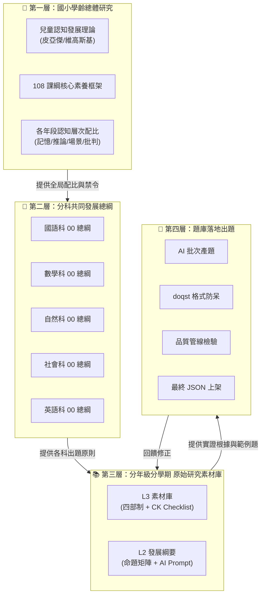
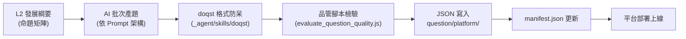

# 【最高指導原則】Eidos 題庫研究與生產四層架構總綱
(Curriculum Deep Research & Production — 4-Layer Master Architecture)

**版本**: v5.0.0 (四層流水線整合版)
**最後更新時間**: 2026-03-18 09:30
**文件定位**：本文件為 Eidos 專案「從學術研究到落地出題」的**完整作業藍圖**。所有 AI Agents 在執行課程擴充、產題或知識盤點時，必須強制遵循以下四層架構與各層驗收標準。

---

## 全局視覺導覽 (Pipeline Overview)



---

## 第一層：國小學齡總體研究 🔬

**📁 對應檔案**：`knowledge/README_課程研究方法與準則.md`（即本文件）

**定位**：所有科目、所有年級共用的「最高天花板」。回答一個根本問題：**不同年齡的孩子，大腦能承受什麼程度的認知挑戰？**

### 1.1 兒童認知發展理論基礎

| 理論 | 核心概念 | 對題庫設計的影響 |
|:---|:---|:---|
| **皮亞傑 (Piaget) 認知發展階段論** | 具體運思期 (7-11) → 形式運思期 (11+) | G1-G4 以具體情境為主；G5-G6 開始引入抽象邏輯 |
| **維高斯基 (Vygotsky) 近側發展區 (ZPD)** | 學習需在「已會」與「即將會」之間搭鷹架 | 誘答項需設計在 ZPD 邊界上，既有挑戰又不致挫折 |
| **認知負荷理論 (Cognitive Load Theory)** | 工作記憶容量有限 (Miller 7±2) | 題幹長度、選項數量需符合年級認知負荷上限 |
| **Bloom 修訂版分類學** | 記憶→理解→應用→分析→評鑑→創造 | 各年級的認知層次配比依此框架遞進 |

### 1.2 全學齡動態認知層次配比

依 108 課綱核心素養精神與皮亞傑理論，各年段的題目認知層次配比：

| 年段 | 記憶提取 | 邏輯推論 | 場景應用 | 價值思辨 | 說明 |
|:---:|:---:|:---:|:---:|:---:|:---|
| **低年級 (G1-G2)** | 60% | 30% | 10% | 🚫 禁止 | 具體運思前期，以建立自信與基礎為主 |
| **中年級 (G3-G4)** | 35% | 40% | 20% | 5% | 具體運思成熟期，開始引入長情境題幹 |
| **高年級 (G5-G6)** | 15% | 30% | 30% | 25% | 形式運思準備期，全面啟動批判性思考 |

### 1.3 全域寫作禁令

| 規則 | 說明 |
|:---|:---|
| 僅用正規學術用詞 | 認知負荷、迷思概念、誘答選項設計、錯誤類型分析 |
| 禁用情緒/隱喻詞 | ❌ 萬惡之首、大腦友善、真實血肉、美味的陷阱、痛點掃描儀 |
| 數據伴隨描述 | 任何學習困難的描述，必須附帶具體現象、課文原文或文獻數據 |

---

## 第二層：分科共同發展總綱 📘

**📁 對應檔案**：`knowledge/課綱研究/[科目]/00_[科目]科共同發展總綱.md`

**定位**：特定科目在**全年級通用**的出題哲學與品質規範。回答：**這個科目的出題，有哪些必須遵守的學科特有規則？**

### 2.1 現有 00 總綱清單

| 科目 | 檔案路徑 | 核心內容摘要 |
|:---|:---|:---|
| 國語 | `課綱研究/國語/00_國語科共同發展總綱.md` | 出題三原則、認知層次配比、修辭誘答守衛點、AI Prompt 架構 |
| 數學 | `課綱研究/數學/00_數學科共同發展總綱.md` | 防盲猜同質性選項、迷思概念地圖、計算與應用題配比 |
| 自然 | `課綱研究/自然/00_自然科共同發展總綱.md` | 科學概念 vs 日常直覺的對撞、實驗設計題型規範 |
| 社會 | `課綱研究/社會/00_社會科共同發展總綱.md` | 地理/歷史/公民三域配比、時事素養題設計 |
| 英語 | `課綱研究/英語/00_英語科共同發展總綱.md` | 聽說讀寫四維、字彙量分級、文法螺旋式鋪排 |
| 生活 | `課綱研究/生活/00_生活科共同發展總綱.md` | G1-G2 專屬的跨域整合出題規範 |

### 2.2 各 00 總綱的標準結構

每份 00 總綱應包含以下固定段落：
1. **出題核心原則**（該科特有的品質防線，如國語科的「誘答三法則」）
2. **全學齡認知層次動態配比**（低/中/高年級的題型比例，與第一層配比對齊）
3. **品管指南**（如：選項長度一致性、誘答項應植入的迷思類型清單）
4. **AI Prompt 架構**（給 AI 產題系統調用的 system prompt 骨架）
5. **金牌範例**（至少一道完美示範題，展示標準的格式與品質）

---

## 第三層：分年級分學期 原始研究素材庫 📚

**📁 對應檔案**：
- **L3 素材庫**：`knowledge/課綱研究/[科目]/[年級]_[學期]_[科目]_原始研究素材庫.md`
- **L2 發展綱要**：`knowledge/課綱研究/[科目]/[年級]_[學期]_[科目]_發展綱要.md` 或 `[年級學期]_[科目]發展綱要.md`

**定位**：特定年級特定學期特定科目的**所有原始研究資料**。回答：**這學期的這個科目，三大出版社教了什麼？學生會在哪裡犯錯？怎樣出題最有效？**

### 3.1 L3 素材庫（四部制結構 — 必須嚴格遵循）

| 部次 | 名稱 | 內容要求 | 對應 CK |
|:---:|:---|:---|:---:|
| 第一部 | **全版本課文基礎目錄** | 康軒/翰林/南一每課課名 + 學習重點，完整不遺漏 | CK-01 |
| 第二部 | **學術文獻與錯誤類型** | 引用 ≥ 2 種實質外部來源（碩論/TASA/考古題/期刊） | CK-02 |
| 第三部 | **教材解析矩陣** | 逐課的生字/語文焦點/閱讀策略，覆蓋率 ≥ 80% | CK-03 |
| 第四部 | **考古題與誘答機制** | ≥ 3 道完整考題 + 每道含誘答干擾機制分析 | CK-04 |

### 3.2 L2 發展綱要（命題轉化層）

L2 是將 L3 素材「收斂」為 AI 可直接調用的**出題規範書**，包含：
- **課程發展矩陣**：每單元/每課的主題、情境建議、核心迷思守衛點（必須引用 L3 的具體數據）
- **AI Prompt 模板**：給自動化產題腳本使用的完整指令
- **品質稽核條件**：如「選項長度差異 ≤ 20%」、「每道題必須有一個基於迷思概念設計的誘答」

### 3.3 L3 → L2 的轉化規則（嚴禁跳層）

```
🚫 禁止：沒有 L3 就直接寫 L2
🚫 禁止：L2 中的迷思概念無法追溯到 L3 的具體文獻來源
✅ 正確：先建立 L3 → 通過 CK-01~CK-06 → 再萃取 L2
```

### 3.4 現有研究資產總表

| 年級學期 | L3 素材庫 | L2 發展綱要 | 備註 |
|:---:|:---:|:---:|:---|
| **G6S1** | ✅ 國語 | ❌ 待建 | 2026-03-17 完成，含真實考卷擷取 |
| **G6S2** | ✅ 國語 | ❌ 待建 | 2026-03-18 完成 |
| **G6 跨科** | — | — | ✅ 已完成「高年級五大科共同發展總綱」先導研究 |
| G5S2 | ✅ 數學/英語/社會/國語 | ✅ 數學/英語/社會/國語 | 最早建立的完整體系 |
| G5S1 | ✅ 數學/自然/社會 | ✅ 數學/自然/社會 | — |
| G4S2 | ✅ 全科 | ⚠️ 部分 | 需補強 L2 |
| G4S1 | ✅ 國語 | ✅ 國語 | — |
| G3S2 | ✅ 全科 (含 CK 示範) | ⚠️ 部分 | 國語科已完成新架構示範 |
| G3S1 | ✅ 數學/國語 | ✅ 數學/國語 | — |

---

## 第四層：題庫落地出題 🎯

**📁 對應目錄**：`question/platform/[年級]/[科目]/[學期]/[出版社]/`

**定位**：將第三層的研究成果**落地為可部署的 JSON 題庫檔案**。回答：**題目最終長什麼樣？格式對不對？品質夠不夠好？**

### 4.1 出題流水線



### 4.2 題庫檔案結構規範

```
question/platform/
├── G3/
│   ├── Chinese/S2/KangHsuan/
│   │   ├── manifest.json          ← 出版社索引檔
│   │   ├── Chi_L1.json            ← 第一課題庫
│   │   ├── Chi_L2.json            ← 第二課題庫
│   │   └── ...
│   ├── Math/S2/HanLin/
│   │   ├── manifest.json
│   │   ├── Math_U1.json
│   │   └── ...
│   └── ...
├── G4/ ...
├── G5/ ...
└── G6/ ...                        ← 待建
```

### 4.3 品質閘門 (Quality Gates)

每批題目在寫入 `question/platform/` 前，必須通過以下關卡：

| 閘門 | 檢驗工具 | 通過條件 |
|:---|:---|:---|
| **格式防呆** | `doqst` Skill | JSON Schema 合規、欄位完整、選項數量正確 |
| **內容品質** | `evaluate_question_quality.js` | 無空白選項、題幹字數適當、答案唯一且正確 |
| **平衡檢查** | `auto_balance_json.js` | 正解分布均勻（A/B/C/D 各 ≈25%）、難度分布合理 |
| **人工抽檢** | 使用者/教師審閱 | 抽樣 10-20% 進行語意正確性驗證 |

---

## 執行 SOP 摘要（快速參照）

| 步驟 | 動作 | 輸入 | 產出 | 驗收 |
|:---:|:---|:---|:---|:---|
| **A** | 建置 L3 素材庫 | 三大版本課程計畫 + 外部研究 | `[年級]_[學期]_[科目]_原始研究素材庫.md` | CK-01 ~ CK-06 全通過 |
| **B** | 萃取 L2 綱要 | L3 素材庫 + 00 科目總綱 | `[年級學期]_[科目]_發展綱要.md` | 矩陣中每個迷思可追溯至 L3 |
| **C** | AI 批次產題 | L2 綱要 Prompt | 初版 JSON 題目 | 格式合規、無空白欄 |
| **D** | 品管與上架 | 初版 JSON + 品管腳本 | 最終版 `question/platform/` | 正解均勻、難度合理、抽檢通過 |

> ⚠️ **絕對禁令**：嚴禁跳過步驟 A 直接執行步驟 B 或 C。沒有 L3 實證根據的題目，等同於「沒有地基的房子」。

---

## L3 交付前必檢清單 (Pre-Delivery Checklist)

> 以下每一條皆為**必須通過**的驗收項目。Agent 在交付前必須逐項自我核對。
> 詳細的通過條件、失敗範例與驗證方法，另見 `_agent/skills/curri_research/SKILL.md`。

| 編號 | 檢查項 | 通過條件 |
|:---:|:---|:---|
| **CK-01** | 第一部含三大版本完整課文目錄 | 每版本每課均以表格呈現，無遺漏 |
| **CK-02** | 第二部引用 ≥ 2 種外部研究素材 | 附具體來源名稱（碩論/TASA/考古題/期刊） |
| **CK-03** | 第三部逐課焦點覆蓋率 ≥ 80% | 生字/句型/策略至少含其一 |
| **CK-04** | 第四部 ≥ 3 道考題含誘答機制 | 每題附正解 + 至少一個誘答干擾機制分析 |
| **CK-05** | 零禁用詞彙 | 無情緒/隱喻/主觀評價用語 |
| **CK-06** | 檔案路徑與命名正確 | `knowledge/課綱研究/[科目]/[年級]_[學期]_[科目]_原始研究素材庫.md` |

---

## 技能觸發方式

當使用者說出「課程研究」、「擴展題庫」、「研究某年級某科目」等指令時，Agent 必須：
1. **強制載入** `_agent/skills/curri_research/SKILL.md`
2. **強制讀取**本文件（即 README_課程研究方法與準則.md）
3. 嚴格依照「第一層 → 第二層 → 第三層 → 第四層」的順序執行，不可跳層
